# TechTrack Use Case Report 

## Introduction

This report configures and evaluates an object-detection pipeline for the TechTrack logistics dataset. The system's role is to detect and classify multiple operationally relevant object categories (vehicles, personal protective equipment items, traffic signs, etc) from images that often contain multiple objects per frame. Because the pipeline is intended as a practical detector, the emphasis throughout is on defensible design choices: selecting a model that performs best overall and on high-impact classes, configuring inference parameters that affect the precision/recall balance, and stress-testing robustness to realistic image distortions we may find in practice.

The report is structured as follows. We first compare two candidate YOLO-tiny models (Model 1 vs Model 2) on the full logistics dataset using mAP and class-level diagnostics to decide which model is the stronger deployment candidate. Next, because the dataset is large and imbalanced, we design a fixed 5000-image evaluation subset using a class-aware and difficulty-aware sampling strategy. In this way, later analyses reflect rare classes and difficult regimes (small objects and dense scenes) rather than being dominated by frequent categories (as it would happen if we used random sampling). Once we identify the best model, we then tune the NMS IoU threshold, a key inference parameter, by sweeping values and measuring the tradeoff between precision and recall, using both accuracy (mAP) and operational signals (detections per image and latency). Finally, we probe robustness and data-selection behavior: we quantify how common types of image distortion (blur, vertical flip, brightness/contrast) affect performance, and we study how Hard Negative Mining (HNM) changes the "hard" subset -defined here as the top-ranked fraction of images after sorting the dataset by each image's total loss score- when varying the values of the different loss weights (the λ terms controlling localization, objectness, background suppression, and classification errors).

Taken together, these tasks form a single pipeline that: 
- chooses the best performing model among Model 1 and Model 2,
- defines a representative evaluation subset,
- chooses optimal values of inference thresholds,
- identifies failure modes and sensitivities that matter for deployment.

## Task 1: Model performance comparison

We evaluated the YOLO Model 1 vs YOLO Model 2 on the full TechTrack logistics dataset (9525 images), caching model outputs. The results are available in notebook ``task1.ipynb``, and we provide here a summary.

Our choice of best model performance is based on the metric mean Average Precision (mAP), computed as the mean of the per-class Average Precision (AP) values under an IoU matching threshold of 0.5. For each class, AP is computed as the area under the precision-recall curve, where the curve is obtained by sweeping a decision threshold over the model's per-class confidence scores and measuring precision and recall at each threshold. We use the 11-point interpolated AP formulation (VOC-style), and then average AP across all classes to obtain mAP:

$$
\text{mAP} = \frac{1}{C}\sum_{c=1}^{C}\text{AP}_c
$$

where $C$ is the number of classes.

We found that Model 2 performs better: it has a higher mAP = 0.51699, versus Model 1 mAP = 0.45925, as shown in Table 1.1.  

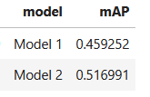

**Table 1.1.** Overall mAP: Model 1 vs Model 2.

These are moderate values for mAP, which is expected for a YOLO-tiny model on a multi-class, real-world logistics dataset.

**Per-class AP comparison**

The per-class AP is summarized here (the column **delta_AP_(M2-M1)** represents the difference $AP(Model 2)-AP(Model1)$ for a given class):

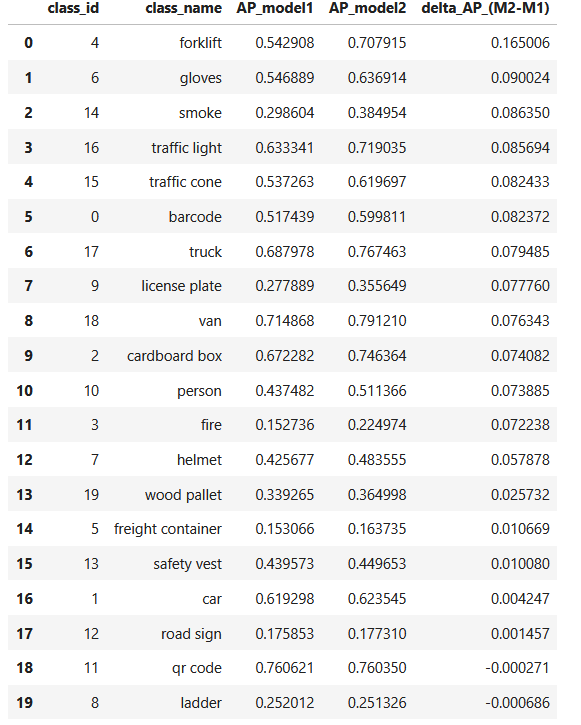

**Table 1.2.** Per-class AP.

This breakdown shows that Model 2's mAP gain is driven by improvements in a few operationally important classes, not just a uniform shift over all classes. The largest gains are for ``forklift`` (+0.165 AP) and ``gloves`` (+0.090), followed by ``smoke`` (+0.086), ``traffic light`` (+0.086), ``traffic cone`` (+0.082), and ``barcode`` (+0.082). Model 2 also improves ``truck``, ``license plate``, ``van``, ``cardboard box``, and ``person`` by approx. +0.07-0.08 AP each. In contrast, a few classes change very little (``car``, ``road sign``) and two are essentially unchanged or slightly worse (``qr code``, ``ladder``). Overall, this suggests Model 2's advantage comes from better handling of several high-impact logistics categories (vehicles, PPE, and hazard indicators) while maintaining parity on classes were Model 1 was already strong.

**Per-class Precision-Recall curves**

To better understand why Model 2 outperforms Model 1, we plot precision-recall (PR) curves for the three classes with the largest AP gains: ``forklift``,`` gloves`` , and ``smoke``. The PR curves show how each model trades off precision versus recall as we vary the decision threshold over the per-class confidence scores.

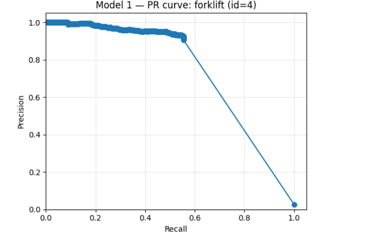

**Figure 1.1.** PR curve for ``forklift``, Model 1.

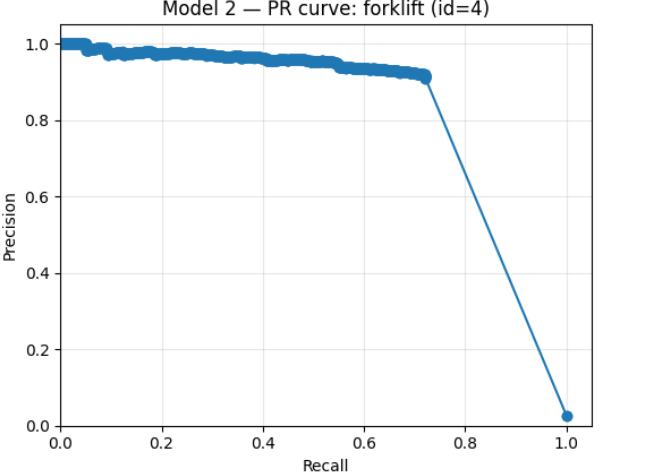

**Figure 1.2.** PR curve for ``forklift``, Model 2.

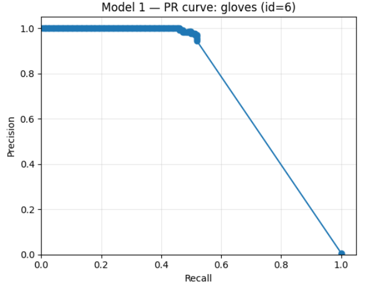

**Figure 1.3.** PR curve for ``gloves``, Model 1.

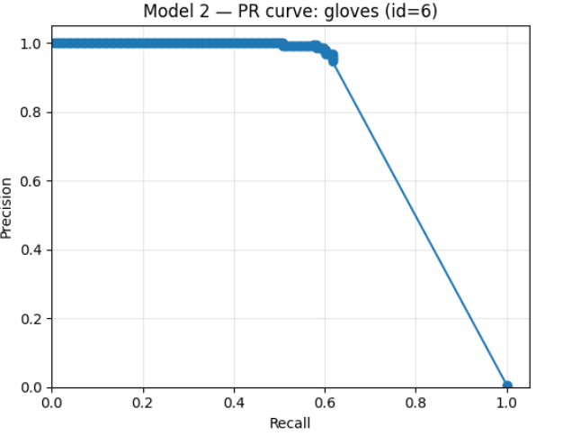

**Figure 1.4.** PR curve for ``gloves``, Model 2.

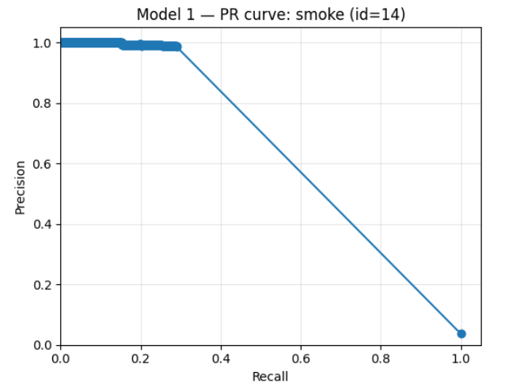

**Figure 1.5.** PR curve for ``smoke``, Model 1.

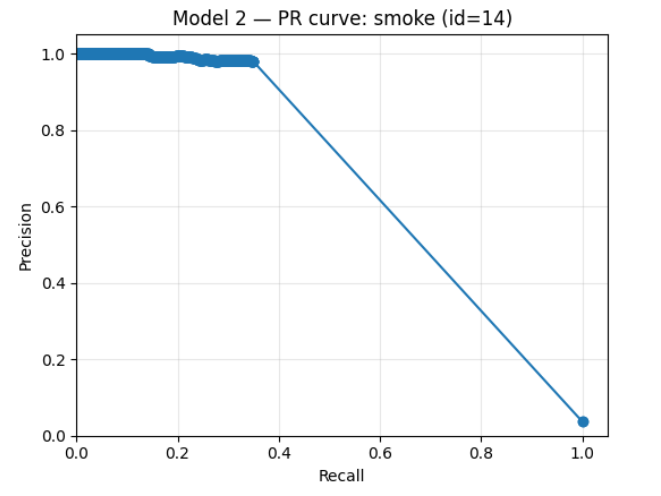

**Figure 1.6.** PR curve for ``smoke``, Model 2.

Across these classes,  Model 2 consistently outperforms Model 1, with its curves positioned higher and/or further to the right — reflecting better precision at equivalent recall levels, or greater recall at the same precision. The most visible improvement is for ``forklift``, where Model 2 maintains strong precision over a wider recall range (the curve stays high for longer before dropping), consistent with the large AP jump seen in the per-class table. For ``gloves`` and ``smoke``, both models achieve high precision at lower recall thresholds, but Model 2 retains this high-precision plateau somewhat further as recall increases. This suggests that Model 2 is better at detecting additional true instances without introducing as many false positives; in other words, it misses fewer objects while keeping predictions more accurate.

**Confusion matrix and heatmaps (matched detections)**

Our notebook also compares Model 1 and Model 2 using a confusion-style breakdown built from matched detections only (namely, $(\text{ground truth}, \text{prediction})$ pairs where a detection matches a ground truth box under the IoU rule, see Table 1.3). We restrict the confusion analysis to matched pairs because including unmatched detections would mix two different failure modes: localization errors (missed objects and spurious detections) and classification errors, making the matrix harder to interpret. On the matched pairs, Model 2 produces more correct matches and fewer errors overall, improving both recall (fewer false negatives) and precision (fewer false positives) at the chosen operating thresholds.

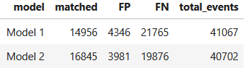

**Table 1.3.** Confusion breakdown.

The per-class false positive (FP) versus false negative (FN) comparison, shown in Table 1.4, indicates that Model 2's main improvement over Model 1 comes from reducing missed detections. We observe that false negative counts drop for essentially every class, which aligns with the overall mAP increase from Model 1 to Model 2. The largest reductions are concentrated in ``person`` (dropping from 3798 to 3224 false negatives) and ``cardboard box`` (dropping from 1672 to 1262 false negatives). Several other classes also show meaningful decreases, such as ``forklift`` (487 to 301), ``helmet`` (1071 to 959), and ``traffic light`` (416 to 308). This pattern is consistent with Model 2 finding more true objects that Model 1 missed, improving recall in a broad way.

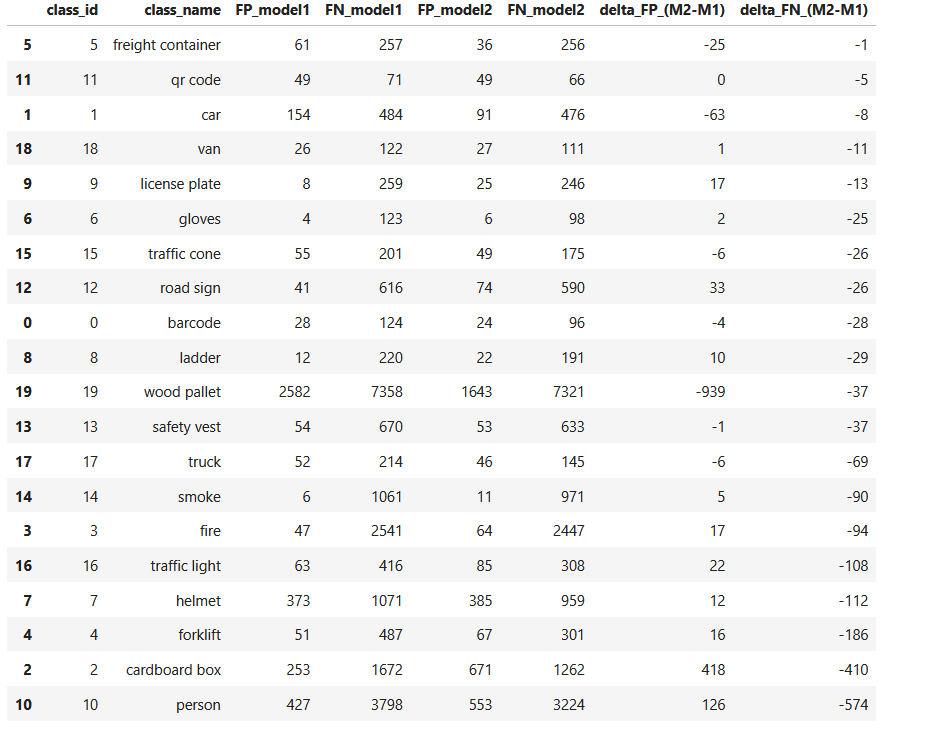

**Table 1.4.** Per-class FN versus FP comparison.

Table 1.4 also shows that these recall gains sometimes come with a precision tradeoff, because false positives increase for some classes even while false negatives decrease. The most obvious example is ``cardboard box``, where false positives rise sharply from 253 to 671 while false negatives fall by a similar magnitude, suggesting the model is picking up more true boxes but also more spurious ones. A similar, smaller effect appears for ``person``, where false positives increase from 427 to 553 even as false negatives fall by 574, and for classes like ``road sign`` and ``license plate`` where false positives rise modestly while false negatives still decline. Overall, the results imply Model 2 is operating with a slightly more recall-oriented behavior on several categories. Whether that tradeoff is desirable depends on the application's tolerance for extra false alarms versus its need to minimize missed detections.

The matched-only confusion heatmaps complement this picture by showing that, conditional on a detection matching a ground-truth object at the chosen IoU threshold, both models are largely predicting the correct class. In both heatmaps the diagonal dominates strongly, and the off-diagonal cells are comparatively faint, which suggests class confusions among already-matched boxes are not a major error mode. Model 2's matrix remains at least as diagonal as Model 1's, indicating that the improvements seen in mAP and in the false negative counts are not being driven by increased class mixing among matched detections. Put differently, the more meaningful differences between the models are happening before the matched-classification step: Model 2 is producing more detections that successfully match ground truth (reducing misses), while maintaining similar class discrimination once those matches exist, and in some classes it pays for that recall improvement with higher false positive rates.

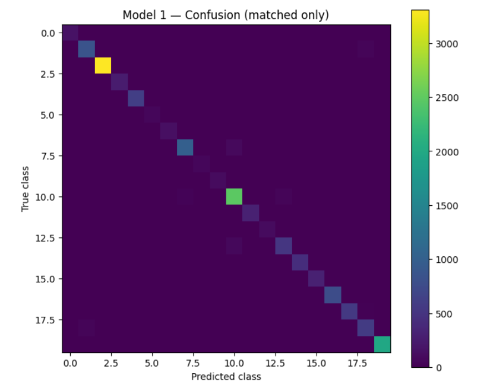

**Figure 1.7.** Confusion heatmap for Model 1.

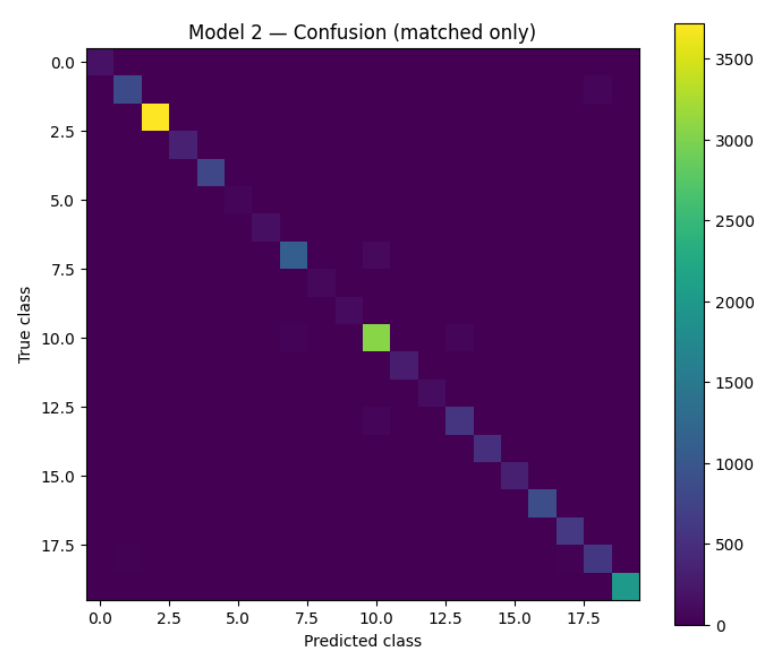

**Figure 1.8.** Confusion heatmap for Model 2.

**Conclusion**

Our conclusion is that, based on a higher overall mAP, a higher matched detections, and a lower FP/FN totals, Model 2 is the stronger model for deployment on the TechTrack logistics dataset- The performance is especially stronger for classes ``forklift``, ``gloves``, ``smoke``, and traffic-related objects.

## Task 2: Sampling strategy

The TechTrack logistics dataset is large enough (9525 labeled images) that we can afford to build a fixed evaluation subset. However, we need to define a sampling strategy: a simple random selection would only be suitable if our dataset was uniform. The datat statistics, which we summarize below, shows that this is far from being the case.

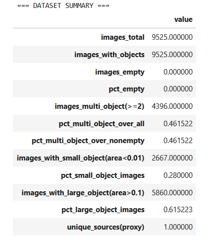

**Table 2.1.** Dataset summary.

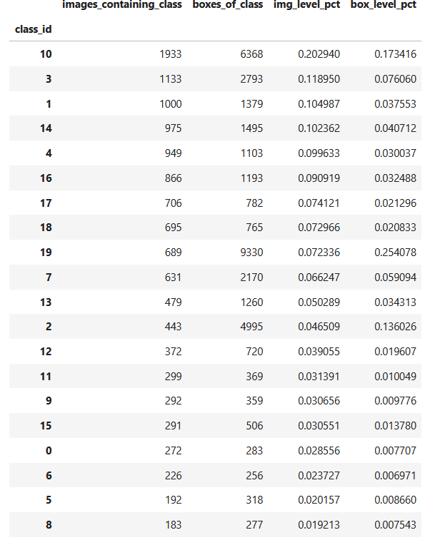

**Table 2.2.** Imbalance statistics.

Reading Table 2.1, we see that a large fraction of the dataset is multi-object: 4396 images (46.15%) contain two or more objects, meaning the model is frequently exposed to cluttered scenes where overlapping detections and assignment errors are more likely. The object size distribution also suggests nontrivial detection difficulty: 2667 images (28%) contain at least one small object (YOLO-normalized area $w\times h<0.01$, where we have set the threshold manually), while 5860 images (61.5%) contain at least one large object ($w\times h$>0.1, again the threshold set manually). This motivates a sampling strategy that maintains coverage of small-object cases and dense images (containing many boxes), since these are common and typically harder for YOLO-style detectors.

The class-frequency table (Table 2.2) shows a clear imbalance for the count of images and boxes (though the imabalnce is different in the two cases). At the image level, class 10 sits on top, appearing in 1933 images (~20.3%), while the least frequent classes appear in only ~1.9-2.4% of images. This already implies a roughly 10x gap in exposure between common and rare classes. At the box level, imbalance is even more pronounced: class 19 accounts for 9330 boxes (~25.4% of all boxes) despite appearing in only 689 images (~7.2%), suggesting that when class 19 appears, it tends to do so many times per image (dense scenes). Similarly, class 2 has 4995 boxes (~13.6%) while appearing in 443 images (~4.7%), again indicating high multiplicity per image. These patterns justify a sampling strategy that accounts for both (i) rare classes (to avoid under-training) and (ii) high-multiplicity classes (to avoid over-dominance by a few dense categories), rather than relying on uniform random sampling.

The object-count distribution table (Table 2.3) shows that most images are relatively sparse, but the dataset has a meaningful long tail of dense scenes. A majority of images contain exactly one object (5129 images; 53.85%), and the frequency drops as the number of objects increases (2 objects: 15.13%, 3 objects: 7.75%, 4 objects: 4.59%, 5 objects: 3.28%). However, the tail extends to extremely crowded frames (up to 224 objects in a single image). This matters for sampling because a small number of very dense frames can disproportionately influence training and evaluation: they contribute many boxes and can bias the model toward classes that occur repeatedly in crowded scenes. It motivates incorporating a density-aware term (penalizing sampling probability as object count grows) so the subset still includes dense images without letting them dominate.

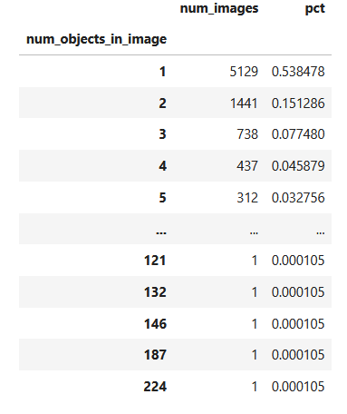

**Table 2.3.** Object count distribution.

The distribution of ground truth box sizes is summarized in Table 2.4, using YOLO-normalized area $w \cdot h$, grouped into small, medium, and large buckets (according to the thresholds we defined above). The dataset contains a substantial fraction of small objects: 39.3% of all boxes have area < 0.01, while 39.6% fall in the medium range \([0.01, 0.1]\) and 21.1% are large \((>0.1)\). This indicates that small-object detection is not a corner case in TechTrack: it is a common regime that can strongly influence model performance. Because small objects are typically harder for YOLO-style detectors (fewer pixels, weaker features), this motivates explicitly boosting images that contain small boxes in the sampling strategy to ensure the sampled subset preserves (or increases) coverage of these difficult examples.

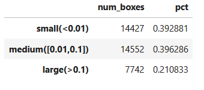

**Table 2.4.** Box size distribution.

To address these issues, we implemented a class-aware, small-object-aware, density-penalized sampling strategy. Each image is assigned a primary class defined as the rarest class present in that image. We then compute a per-image sampling weight as a product of three terms: rare-class weighting $w_{\text{class}} = 1 / f(c)^{\alpha}$, where $f(c)$ represents the dataset frequency of the image's primary class (the proportion of images that contain class $c$); a small-object boost (multiply by \$beta$ if the image contains at least one small ground-truth box); and a density penalty $w_{\text{density}} = 1/\sqrt{1+n_{\text{objects}}}$, where $n_{\text{objects}}$ is the number of boxes in the image. The final weight is $$w=w_{\text{class}} \times w_{\text{small}} \times w_{\text{density}}.$$ Our sampler uses α=0.5 (moderate rare-class emphasis) and β=1.5 (explicit boost for small-object images).

The weight summary table (Table 2.4) provides a sanity check on the sampling distribution produced by our weighting scheme. Across 9525 images, weights have a modest spread: the median weight is 0.02295, the 90th percentile is 0.04145, and even the 99th percentile is only 0.05544, with a maximum of 0.07841. This indicates that the sampler is not assigning extreme probabilities to a tiny number of images; instead, it gently upweights under-represented or difficult cases while keeping the distribution stable. In practice, this is desirable because it increases coverage of rare classes and small-object images without collapsing the subset onto a small set of high-weight frames.

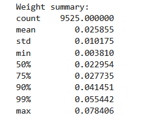
**Table 2.5.** Weight statistics.

Finally, we created a sampled subset of 5000 images according to the scheme we have described, and stored it in ``analysis/analysis_cache_samplig/sampled_subset``.

## Task 3: NMS threshold design (Model 2):

Non-Maximum Suppression (NMS) is a core part of our inference pipeline: after the model proposes many candidate boxes, NMS removes redundant, highly-overlapping detections so that each object is ideally represented by a single bounding box. The key control parameter in NMS is the IoU threshold, which determines how much overlap is allowed before a lower-scoring box is suppressed. If the threshold is set too low, NMS becomes overly aggressive and can suppress true positives in crowded scenes (increasing false negatives). If it is set too high, many overlapping boxes are retained, leading to duplicate detections and more false positives. Because this parameter directly affects the precision-recall tradeoff (and therefore mAP), we run a systematic threshold sweep to select a operating point rather than relying on a default value.

We swept the NMS IoU threshold across a grid consisting of the values **[0.30, 0.35, 0.40, 0.45, 0.50, 0.55, 0.60]**, and for each value we ran the full inference pipeline (predict → post_process → NMS) on our sampled subset (5000 images). For each threshold we computed:

- overall mAP (11-point interpolation, defined in the `metrics.py` pipeline),
- total FP and FN counts (as a precision/recall tradeoff proxy),
- mean detections per image,
- approximate per-image latency. 

The results are summarized in the following table:

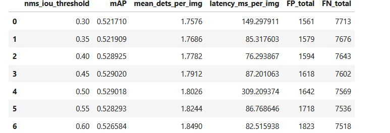

**Table 3.1.** NMS sweep for Model 2.

The table shows that:

- *The best mAP occurs at NMS IoU = 0.45, with mAP ≈ 0.529020. 
- The mAP values are very close for 0.40, 0.45, and 0.50:

  * 0.40 → maP =0.528925
  * 0.45 → mAP = 0.529020 (best)
  * 0.50 → mAP = 0.529018 (almost tied, but has much worse latency) 

We observe the following tradeoffs:

* As the threshold increases (less aggressive suppression), the detector tends to keep more boxes per image, which increases ``FP_total``, while ``FN_total`` decreases slightly.
* In our sweep, 0.50 shows unusually high latency (~309 ms/img) compared to nearby settings (~76-87 ms/img), which makes 0.45 a better operational choice even though their mAP are nearly tied. 

The following plots summarize how the NMS IoU threshold affects the behavior of Model 2.

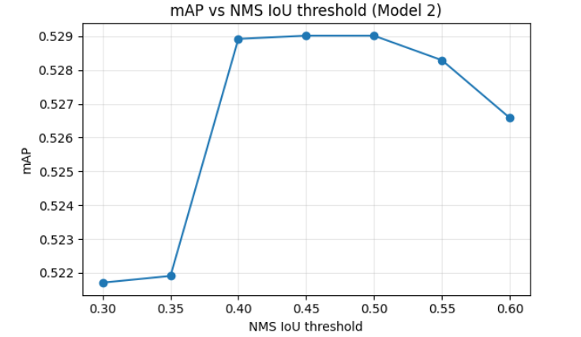

**Figure 3.1.** mAP at 0.5 vs. NMS IoU Threshold.

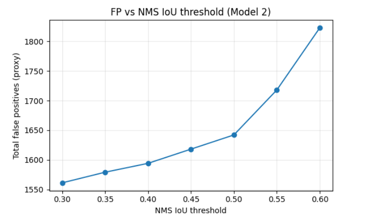

**Figure 3.2.** False Positives vs. NMS IoU Threshold.

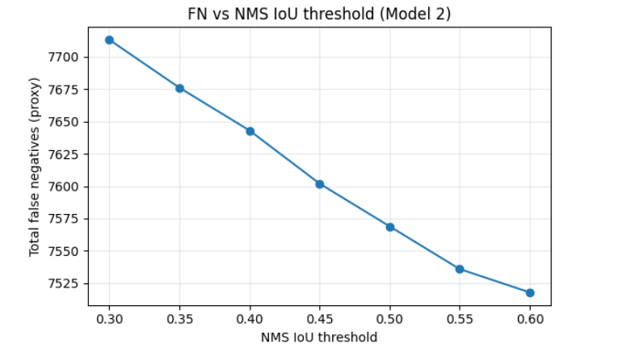

**Figure 3.3.** False Negatives vs. NMS IoU Threshold.

As we increase the NMS IoU threshold, NMS becomes less aggressive (it suppresses fewer overlapping boxes), which changes the balance between false positives (FP), false negatives (FN), and overall detection quality (measured by mAP). The results show a clear tradeoff: increasing the NMS IoU threshold steadily reduces FN (slightly improves recall) but also increases FP (more duplicate/spurious detections). mAP improves sharply from 0.30-0.35 up to the 0.40-0.50 range, then begins to decline beyond ~0.50 as FP accumulation outweighs recall gains. These curves support selecting a threshold near the peak region (≈0.45) as a balanced operating point.

Although we choose a single NMS IoU threshold based on overall mAP, different object classes can respond differently to NMS tuning. Some classes are more prone to duplicate detections (benefiting from stronger suppression), while others have closely spaced instances where aggressive suppression can accidentally remove true positives. To check whether our chosen best NMS threshold disproportionately helps or harms specific categories, we compare per-class AP at the baseline threshold versus the selected best threshold and report the per-class change. 

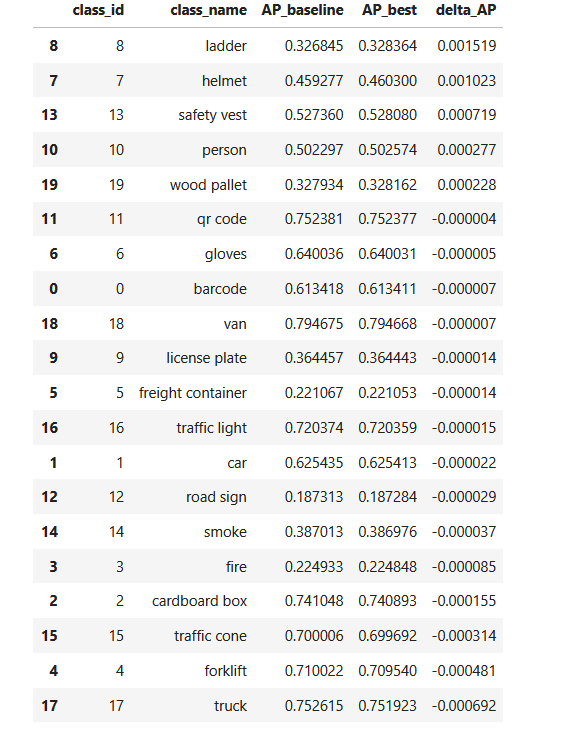

**Table 3.2.** Per-class AP sensitivity to NMS IoU threshold (Model 2): baseline vs selected best setting.

The table shows that per-class AP changes are extremely small between the baseline and best NMS settings (ΔAP mostly within about ±0.001), implying that the overall mAP optimum is driven by small, aggregated effects rather than a large shift in any one class.

**Conclusion:** the recommended threshold for deployment is ``nms_iou_threshold = 0.45`` for Model 2.

## Task 4: Augmentation impact

Data augmentation is a standard way to probe a detector's robustness to real-world variation. In deployment, cameras can introduce blur (motion/out-of-focus), illumination can change across time and weather, and viewpoint can vary; if a model is overly sensitive to these shifts, performance can degrade even if it scores well on the original dataset. We therefore evaluate augmentation impact as a robustness analysis: rather than retraining, we apply controlled transformations at test time and measure how model performance changes. This identifies which perturbations are most harmful, and which classes are most affected.

We performed the robustness analysis against three common augmentation transformations: Gaussian blur, vertical flip and brightness/contrast changes, focusing on the sampled subset (5000 images). Our implementation handles the key detail that ground-truth boxes must be transformed for vertical flips (``y`` becomes `H - (y + h)` in xywh pixel format). 

The following table summarizes overall mAP (11-point interpolation) plus per-class AP changes. 

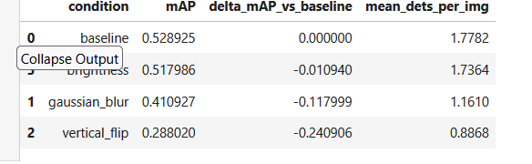

**Table 4.1.** Sensitivity to augmentation.

The baseline mAP is 0.528925, slightly different from the one obtained in Task 1 since we are now focusing on the sampled subset with 5000 images only. We observe the following effects of the different augmentations. Brightness causes only a small degradation to 0.517986 (ΔmAP ≈ -0.01094), suggesting Model 2 is relatively robust to moderate brightness/contrast shifts. Gaussian blur produces a larger drop to 0.410927 (ΔmAP ≈ -0.1180), consistent with blur removing texture and edge cues that some classes rely on. Vertical flip causes the most severe degradation: mAP falls to 0.288020 (ΔmAP ≈ -0.2409). This is also reflected in detection volume: mean detections per image drops from 1.7782 (baseline) to 0.8868 (vertical flip), indicating many objects are not detected at all after flipping.

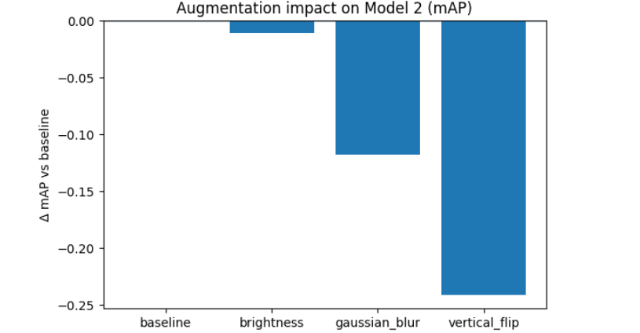

**Figure 4.1.** mAP after augmentation.

Overall mAP tells us how much performance drops on average under each augmentation, but it does not tell us which classes are driving the drop. The following table breaks the robustness analysis down per class, reporting baseline AP and the AP change under Gaussian blur, vertical flip, and brightness. This is important because different classes rely on different visual cues (fine texture, clear edges, canonical orientation), so a single augmentation can disproportionately affect certain object types.

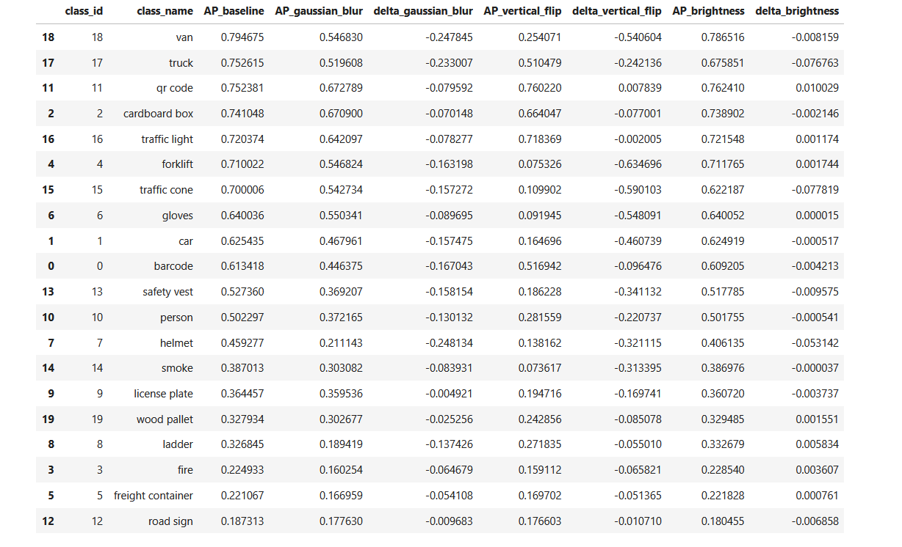

**Table 4.2.** Per-class sensitivity to augmentations.

The table shows a clear hierarchy of sensitivity across augmentations:

- Vertical flip produces the largest negative AP changes for many classes, with especially severe drops for classes that have strong upright-world structure in the training data (``forklift``, ``traffic cone``, ``gloves``, ``car``, ``van``). This aligns with the large overall mAP drop and the large reduction in detections per image under vertical flip.

- Gaussian blur causes substantial AP decreases for classes that depend on fine detail and sharp boundaries (smaller objects and texture-heavy categories), though typically not as extreme as vertical flip.

- Brightness changes have the smallest impact overall: most classes show only minor AP shifts (some even slightly improve), indicating Model 2 is relatively stable to moderate illumination/contrast variation compared with blur and vertical flips. This is expected, as object detectors typically learn features that are comparatively invariant to global intensity/contrast shifts (object geometry, edges, scene layout, etc), and our brightness adjustment preserves these characteristics (and therefore structural information).

## Task 5: Hard Negative Mining parameter study

Hard Negative Mining (HNM) is a data selection strategy that focuses analysis on the examples a model currently finds most difficult. Instead of sampling images uniformly, HNM assigns each image a hardness score (typically derived from a loss function), ranks the dataset by that score, and then selects a top fraction as the hard subset. This hard subset can be used to target failure cases, accelerate learning on difficult scenarios, and improve performance on under-represented or challenging conditions.

In our implementation, the hardness score is computed using our modified YOLO-style loss that combines multiple error types (localization, objectness for true objects, objectness for background/no-object, and classification). The λ weights control how much each component contributes to the total loss, so changing λ directly changes the hardness ranking. For example, if we increase the weight on the no-object term, images with many false positives become harder to detect and will be mined more often; if we increase the weight on the objectness term, images with missed detections become the primary focus. In other words, λ defines what "hard" means, and HNM will sample different kinds of images depending on which failure mode we choose to emphasize.

This section studies how Hard Negative Mining (HNM) behaves when we change the λ weights in our loss function. In HNM, we do not treat every training image equally, instead, we compute a loss score per image and preferentially sample the images that the model currently finds most difficult (the "hard negatives"). Our loss is composed of multiple components (localization, objectness for true objects, objectness for background/no-object, and classification). Each λ controls how much we emphasize a particular failure mode when computing the overall "hardness" score.

Concretely, each image receives a total loss of the form:

$$
L_{\text{total}} = \lambda_{\text{coord}} L_{\text{loc}} + \lambda_{\text{obj}} L_{\text{obj}} + \lambda_{\text{noobj}} L_{\text{noobj}} + \lambda_{\text{cls}} L_{\text{cls}}
$$

HNM then ranks images by $L_{\text{total}}$ and selects the top fraction as the hard set. Because the λ values control how strongly each failure mode contributes to $L_{\text{total}}$, they directly change which images rise to the top:

* **$\lambda_{\text{coord}}$ (localization weight)**: Increasing this weight makes HNM prioritize images where predicted boxes are geometrically inaccurate: for instance, boxes that are shifted, too large/small, poorly aligned with object edges, or have low IoU with the ground truth even when the class is correct. This tends to emphasize box-regression hard cases such as partial occlusions, truncation at image borders, and crowded scenes where box placement is ambiguous.

* **$\lambda_{\text{obj}}$ (objectness on true objects)**: Increasing this weight emphasizes images where the model fails to assign high confidence to real objects: missed detections and low-confidence true positives (false negatives / recall failures). This typically selects recall-hard images: small objects, heavily occluded objects, low-contrast objects, unusual viewpoints, and dense scenes where true objects are easy to overlook.

* **$\lambda_{\text{noobj}}$ (background / no-object penalty)**: Increasing this weight prioritizes images where the model produces confident detections that do not correspond to any ground truth (false positives). This surfaces precision-hard images: cluttered backgrounds, repetitive textures, reflections, signage-like patterns, or confusing structures that frequently trigger spurious boxes.

* **$\lambda_{\text{cls}}$ (classification weight)**: Increasing this weight emphasizes images where the model localizes an object but assigns the wrong class distribution, corresponding to misclassification errors among visually similar categories (for example, confusing vehicles, PPE items, or sign-like objects). This selects class-confusion hard images where appearance cues overlap, objects are small/blurry, or multiple related classes co-occur.

The goal of this analysis is to show how turning these λ parameters changes the composition of the sampled hard set (e.g., toward recall-hard vs. precision-hard vs. localization-hard vs. misclassification-hard images).

Note that loss components can be on very different numeric scales, and if one component is orders of magnitude larger than the others, then changing λ within a small range will not modify the hardness ranking much, because the biggest-magnitude term dominates the total score. This is what we found for the localization component: in the initial runs, ``loc_loss`` was numerically far larger than the rest of the terms (``loc_loss_mean ≈ 14023`` in the mined set, while ``conf_loss_obj_mean ≈ 1.35``, ``conf_loss_noobj_mean ≈ 0.21``, and ``class_loss_mean ≈ 0.28``). As a result, the top-hard images were effectively being ranked by localization error alone, which explains why multiple λ configurations selected almost the same subset (Jaccard overlap ≈ 1.0). The following table shows the relative scale of each component after ranking images by total loss, showing that the localization term dominates the total score. **config** refers to the specific λ-weight setting used in the loss function (each **config** option changes the relative weight placed on a particular loss component).

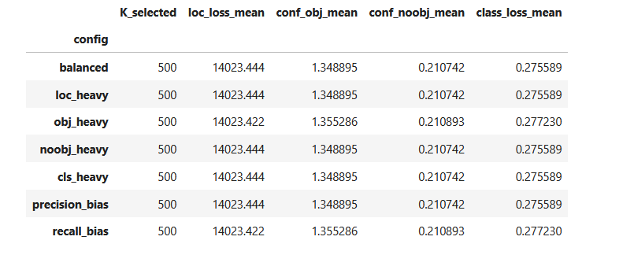

**Table 5.1.** Mean loss-component magnitudes in the mined hard set (Top 10%, K=500) across λ configurations.

Consequently, we needed to add a scale-compensation step (reweighting) to make λ changes observables. We defined each component scale as the mean loss component values within the mined hard set, and then defined scale-compensated λ values dividing by this scale. Next, we define a baseline top 10% hard set (500 images) and then vary one λ at a time by multipliers (0.25×, 0.5×, 1×, 2×, 4×). This produces meaningful shifts in overlap with the baseline selection: the Jaccard overlap drops substantially for certain parameter cofigurations (so the mined images are genuinely different). The most different variants (smaller Jaccard) with respect to the baseline are the following:

* ``λ_obj`` × 4.0 → Jaccard ≈ 0.572 (largest change)
* ``λ_noobj`` × 4.0 → Jaccard ≈ 0.597
* ``λ_noobj`` × 0.25 → Jaccard ≈ 0.681
* ``λ_cls`` × 4.0 → Jaccard ≈ 0.686

We summarize here a few observations from the notebook summaries:

* Increasing ``λ_obj`` (objectness) tends to produce hard sets with more objects per image and a higher fraction of small objects. 
* Increasing ``λ_noobj`` shifts toward false-positive-heavy images. 
* Increasing ``λ_cls`` shifts toward misclassification-heavy images.

After computing scale-compensated λ values, we still need to verify that changing each λ actually changes (1) which images are mined as hard negatives, and (2) what kinds of difficulty those images represent. The three plots below make that relationship concrete: they show how the mined hard set (Top 10%) shifts as we multiply one λ at a time (0.25× → 4×) while holding the others fixed. We track set overlap (Jaccard vs baseline) and two interpretable "hardness" descriptors of the mined set: (i) average number of objects per image and (ii) fraction of images containing small ground-truth objects. In order to quantify the latter, we introduce ``pct_small_gt`` as a measure of how common small objects are in a sampled (mined) subset of images. For each image, we read its YOLO label file and compute the normalized area of every ground-truth box as ($w \times h$), where ($w$) and ($h$) are the YOLO-normalized width and height (values in ([0,1])). If an image contains at least one ground-truth box with area below a fixed threshold (in our analysis, ``SMALL_AREA_TH = 0.01``), we flag that image as containing a small object (``has_small_gt = True``). Finally, for any sampled subset (in our case, the Top 10% HNM hard set), ``pct_small_gt`` is the fraction of images in that subset with ``has_small_gt = True``.

 **Hard-set overlap (Jaccard) vs multiplier**

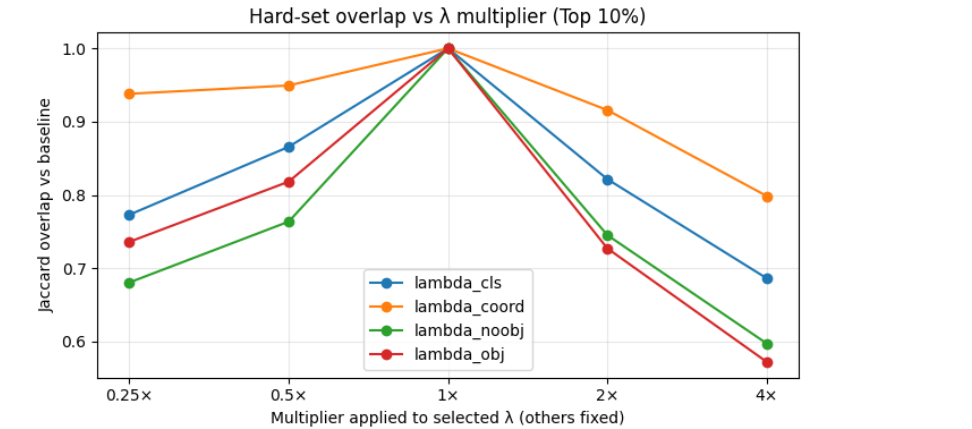

**Figure 5.1.** Jaccard vs multiplier.

At 1× all curves meet at 1.0 because that is the baseline selection. Moving away from 1× shows which λ has the strongest effect on which images enter the Top-10% hard subset. The biggest drops in overlap happen when we change ``λ_obj`` (red) and ``λ_noobj`` (green), meaning those weights most strongly change which images are considered hard. ``λ_coord`` (orange) changes the set the least (higher overlap across multipliers), and ``λ_cls`` (blue) is in between. This is exactly what we expect if objectness/no-objectness are the knobs that most change hardness type (FN-heavy vs FP-heavy), while localization stays relatively stable.

 **Average #objects in the mined set**

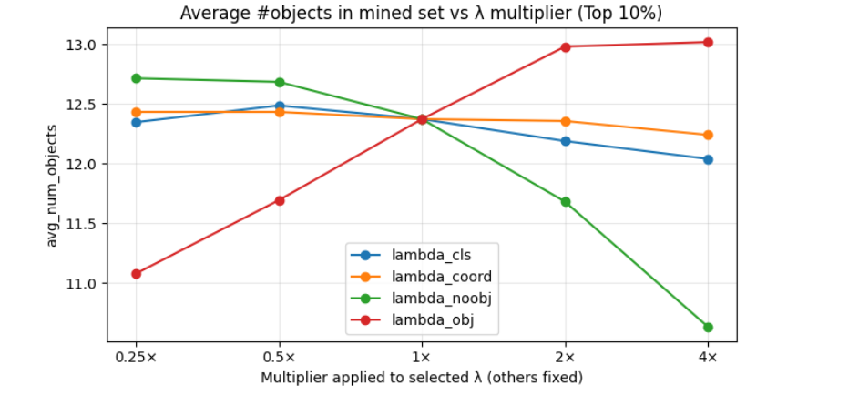

**Figure 5.2.** Average number of objects in the mined set.

As ``λ_obj`` increases, the mined set becomes denser (avg objects rises from ~11.1 at 0.25× to ~13.0 at 4×). This fits the intuition: emphasizing objectness-on-true-objects prioritizes images where the model struggles to confidently detect real objects—dense scenes with many objects are more likely to contain missed detections or low-confidence detections. As ``λ_noobj`` increases, the mined set becomes less dense (avg objects drops sharply to ~10.6 at 4×). This also makes sense: emphasizing the no-object term penalizes false positives, which often come from background clutter or confusing patterns rather than simply having lots of labeled objects. So the selected hard images shift away from highly populated scenes and toward FP-prone backgrounds.

 **Fraction of images with small GT objects**

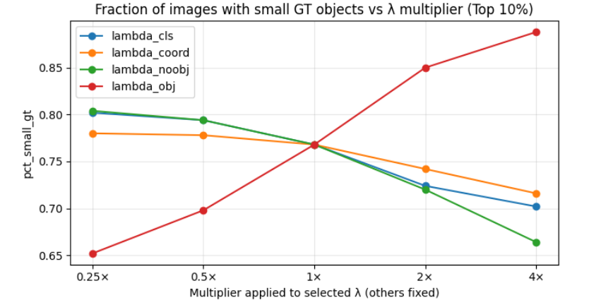

**Figure 5.3.** Fraction of images with small ground truth objects.

As ``λ_obj`` increases, ``pct_small_gt`` rises strongly (~ 0.65 → ~ 0.89). That is very intuitive: small objects are harder to detect reliably, so if we weight objectness errors more, images containing small targets become much more likely to rank as hard. As ``λ_noobj`` increases, ``pct_small_gt`` decreases (~0.80 → ~0.66). Again intuitive: the no-object term pushes the mining focus toward false positives, which does not necessarily correlate with the presence of small ground truth objects (and may even prioritize backgrounds where small ground truth are absent).

Overall, these plots confirm that once loss terms are scale-compensated, the λ's become a meaningful set of control parameters for HNM. In particular, ``λ_obj`` shifts mining toward crowded and small-object scenes (recall-hard), while ``λ_noobj`` shifts mining toward false-positive-heavy scenes (precision-hard). ``λ_coord`` and ``λ_cls``  have comparatively weaker influence. This is expected, as classification and localization are conditional errors: they matter most when the model already produced a reasonable detection. Many hard images are dominated by whether detections happen at all (FN/FP behavior), so objectness terms still provide a stronger sorting signal.

## Conclusions

**Model 2** is the best onject detection model on our dataset, improving mAP from **0.459** to **0.517** and achieving broad reductions in false negatives across nearly all classes. To support efficient and representative evaluation, we designed a class-aware, small-object-aware, density-penalized sampling strategy and used it to produce a fixed 5000-image subset, which preserves difficult regimes (small objects, crowded scenes) while preventing high-multiplicity classes from dominating.

For inference-time configuration, an **NMS IoU threshold of 0.45** provides the best operational point for Model 2 on the sampled subset: it is at the peak mAP region, while avoiding the unusually high latency observed at 0.50 and maintaining a reasonable FP/FN balance. 

Robustness tests show that Model 2 is relatively stable to brightness/contrast changes, but is substantially degraded by Gaussian blur, and especially by vertical flips, suggesting the model relies on canonical upright-world structure and fine visual detail for several key categories.

Finally, the HNM parameter study confirms that λ weights can meaningfully control what "hard" means, but only after accounting for loss-scale imbalance. Without scale compensation, localization dominates and different λ settings select almost identical subsets. After scale-aware normalization, varying ``λ_obj`` shifts mining toward dense, small-object (recall-hard) images, while ``λ_noobj`` shifts mining toward false-positive-heavy (precision-hard) images, demonstrating that the λ parameters can be used for targeted hard negative selection.
